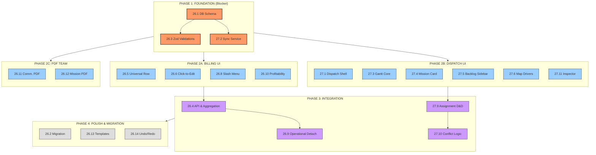

# 🎮 BMAD MASTER CONTROL CENTER
> **Project:** Sixième Etoile (Epics 26 & 27)
> **Mode:** Massive Parallel Execution
> **Status:** 🟢 READY TO LAUNCH

This document is your **Command Center**. Follow the sequences strictly.
Use **Cmd+Click** on the links below to jump directly to the prompt text.

---

## 📊 VISUAL ATTACK PLAN

---

## 🚀 EXECUTION DASHBOARD (CLICK & COPY)

### 🛑 PHASE 1: CRITICAL INFRASTRUCTURE
*Run this on your **BEST** Agent (Antigravity/Windsurf) before anything else.*

| Order | Story | Agent | Link to Prompt |
| :--- | :--- | :--- | :--- |
| **1** | **26.1 Schema** | 🧠 Big | [👉 GO TO PROMPT](EPIC-26-PROMPTS.md#story-261-database-schema-update-for-hybrid-blocks) |
| **2** | **26.3 Zod** | 🧠 Big | [👉 GO TO PROMPT](EPIC-26-PROMPTS.md#story-263-hybrid-block-validation-layer-zod) |
| **3** | **27.2 Sync** | 🧠 Big | [👉 GO TO PROMPT](EPIC-27-PROMPTS.md#story-272-mission-synchronization-service) |

---

### ⚡️ PHASE 2: UI SWARM (Massive Parallel)
*Once Phase 1 is done, assign each line to a separate "Google Jules" or Agent.*

**Billing Team (Epic 26)**
| Story | Component | Link to Prompt |
| :--- | :--- | :--- |
| **26.5** | **Universal Row** | [👉 GO TO PROMPT](EPIC-26-PROMPTS.md#story-265-ui-universal-block-row-component) |
| **26.6** | **Click-to-Edit** | [👉 GO TO PROMPT](EPIC-26-PROMPTS.md#story-266-ui-click-to-edit-inline-forms) |
| **26.8** | **Slash Menu** | [👉 GO TO PROMPT](EPIC-26-PROMPTS.md#story-268-ui-slash-commands-menu) |
| **26.10** | **Profitability** | [👉 GO TO PROMPT](EPIC-26-PROMPTS.md#story-2610-real-time-profitability-computation) |

**Dispatch Team (Epic 27)**
| Story | Component | Link to Prompt |
| :--- | :--- | :--- |
| **27.1** | **Shell Layout** | [👉 GO TO PROMPT](EPIC-27-PROMPTS.md#story-271-dispatch-shell--navigation) |
| **27.3** | **Gantt Core** | [👉 GO TO PROMPT](EPIC-27-PROMPTS.md#story-273-gantt-core-timeline-rendering) |
| **27.4** | **Mission Card** | [👉 GO TO PROMPT](EPIC-27-PROMPTS.md#story-274-hybrid-mission-rendering) |
| **27.5** | **Backlog Side** | [👉 GO TO PROMPT](EPIC-27-PROMPTS.md#story-275-unassigned-backlog-sidebar) |
| **27.6** | **Driver Map** | [👉 GO TO PROMPT](EPIC-27-PROMPTS.md#story-276-live-map---driver-locations) |
| **27.11** | **Inspector** | [👉 GO TO PROMPT](EPIC-27-PROMPTS.md#story-2711-inspector-panel---quick-actions) |

**PDF Team**
| Story | Document | Link to Prompt |
| :--- | :--- | :--- |
| **26.11** | **Comm. PDF** | [👉 GO TO PROMPT](EPIC-26-PROMPTS.md#story-2611-pdf-generator-display-mode) |
| **26.12** | **Mission PDF** | [👉 GO TO PROMPT](EPIC-26-PROMPTS.md#story-2612-pdf-generator-mission-order) |

---

### 🔗 PHASE 3: INTEGRATION (Logic & State)
*Requires Phase 2 components to be ready.*

| Story | Feature | Agent | Link to Prompt |
| :--- | :--- | :--- | :--- |
| **26.4** | **API CRUD** | 🧠 Big | [👉 GO TO PROMPT](EPIC-26-PROMPTS.md#story-264-backend-api-crud-for-nested-lines) |
| **26.7** | **Drag & Drop** | ⚡️ Small | [👉 GO TO PROMPT](EPIC-26-PROMPTS.md#story-267-ui-drag--drop-reordering) |
| **26.9** | **Detach Logic** | 🧠 Medium | [👉 GO TO PROMPT](EPIC-26-PROMPTS.md#story-269-operational-detach-logic) |
| **27.9** | **Assign D&D** | 🧠 Medium | [👉 GO TO PROMPT](EPIC-27-PROMPTS.md#story-279-dispatch-actions---drag--drop-assignment) |
| **27.10** | **Conflicts** | 🧠 Medium | [👉 GO TO PROMPT](EPIC-27-PROMPTS.md#story-2710-conflict-detection) |
| **27.13** | **Real-time** | 🧠 Medium | [👉 GO TO PROMPT](EPIC-27-PROMPTS.md#story-2713-real-time-updates) |

---

### 🎨 PHASE 4: POLISH & MIGRATION

| Story | Feature | Link to Prompt |
| :--- | :--- | :--- |
| **26.2** | **Migration** | [👉 GO TO PROMPT](EPIC-26-PROMPTS.md#story-262-backward-compatibility-migration-script) |
| **26.13** | **Templates** | [👉 GO TO PROMPT](EPIC-26-PROMPTS.md#story-2613-block-presets-templates) |
| **26.14** | **Undo/Redo** | [👉 GO TO PROMPT](EPIC-26-PROMPTS.md#story-2614-undo-redo-history-support) |
