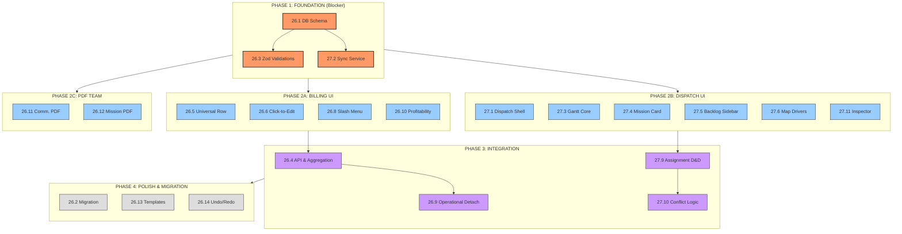

# 🎮 BMAD MASTER CONTROL CENTER
> **Project:** Sixième Etoile (Epics 26 & 27)
> **Mode:** Massive Parallel Execution
> **Status:** 🟢 READY TO LAUNCH

This document is your **Command Center**. Follow the sequences strictly.
Use **Cmd+Click** on the links below to jump directly to the prompt text.

---

## 📊 VISUAL ATTACK PLAN

---

## 🚀 EXECUTION DASHBOARD (BACKLOG FOCUS)

### 🛑 PHASE 1: REMAINING INFRASTRUCTURE (Epic 26/27)
*Critical items remaining before full rollout.*

| Order | Story | Agent | Link to Prompt |
| :--- | :--- | :--- | :--- |
| **1** | **26.9 Operational Detach** | 🧠 Big | [👉 GO TO PROMPT](EPIC-26-PROMPTS.md#story-269-operational-detach-logic) |
| **2** | **27.7 Map Context** | 🧠 Medium | [👉 GO TO PROMPT](EPIC-27-PROMPTS.md#story-277-live-map---mission-context-layer) |
| **3** | **27.10 Conflict Logic** | 🧠 Medium | [👉 GO TO PROMPT](EPIC-27-PROMPTS.md#story-2710-conflict-detection) |

---

### 🎨 PHASE 2: UI POLISH & ENHANCEMENTS (Backlog)
*Items to refine the experience.*

| Story | Feature | Link to Prompt |
| :--- | :--- | :--- |
| **26.19** | **Quote Cart UX** | [👉 GO TO PROMPT](EPIC-26-PROMPTS.md#story-2619-enhanced-quote-cart-interactions) |
| **26.20** | **Glassmorphism** | [👉 GO TO PROMPT](EPIC-26-PROMPTS.md#story-2620-visual-polish-glassmorphism) |
| **26.21** | **Cart Templates** | [👉 GO TO PROMPT](EPIC-26-PROMPTS.md#story-2621-template-saving-for-multi-item-quotes) |
| **27.8** | **Map Suggestions** | [👉 GO TO PROMPT](EPIC-27-PROMPTS.md#story-278-map---smart-assignment-suggestions) |
| **27.12** | **Gantt Zoom** | [👉 GO TO PROMPT](EPIC-27-PROMPTS.md#story-2712-gantt---time--zoom-controls) |
| **27.14** | **Export Sched.** | [👉 GO TO PROMPT](EPIC-27-PROMPTS.md#story-2714-export-schedule) |

---

### 📦 PHASE 3: EPIC 28 - ORDER MANAGEMENT (NEW!)
*Launch only after Phase 1 is stable.*

**Part A: Infrastructure**
| Story | Feature | Link to Prompt |
| :--- | :--- | :--- |
| **28.1** | **Order Schema** | [👉 GO TO PROMPT](EPIC-28-PROMPTS.md#story-281-order-entity--prisma-schema) |
| **28.2** | **Order API** | [👉 GO TO PROMPT](EPIC-28-PROMPTS.md#story-282-order-state-machine--api) |
| **28.3** | **Dossier UI** | [👉 GO TO PROMPT](EPIC-28-PROMPTS.md#story-283-dossier-view-ui---skeleton--tabs) |

**Part B: Intelligent Spawning**
| Story | Feature | Link to Prompt |
| :--- | :--- | :--- |
| **28.4** | **Spawn Engine** | [👉 GO TO PROMPT](EPIC-28-PROMPTS.md#story-284-spawning-engine---trigger-logic) |
| **28.5** | **Group Spawn** | [👉 GO TO PROMPT](EPIC-28-PROMPTS.md#story-285-group-spawning-logic-multi-day) |
| **28.6** | **Opt. Dispatch** | [👉 GO TO PROMPT](EPIC-28-PROMPTS.md#story-286-optional-dispatch--force-enable) |
| **28.7** | **Manual Items** | [👉 GO TO PROMPT](EPIC-28-PROMPTS.md#story-287-manual-item-handling-ui) |
| **28.13** | **Free Missions** | [👉 GO TO PROMPT](EPIC-28-PROMPTS.md#story-2813-ad-hoc-free-missions) |

**Part C: Flexible Invoicing**
| Story | Feature | Link to Prompt |
| :--- | :--- | :--- |
| **28.8** | **Detach Invoice** | [👉 GO TO PROMPT](EPIC-28-PROMPTS.md#story-288-invoice-generation---detached-snapshot) |
| **28.9** | **Invoice Editor** | [👉 GO TO PROMPT](EPIC-28-PROMPTS.md#story-289-invoice-ui---full-editability) |
| **28.10** | **Feedback Loop** | [👉 GO TO PROMPT](EPIC-28-PROMPTS.md#story-2810-execution-feedback-loop-placeholders) |
| **28.11** | **Partial Bill** | [👉 GO TO PROMPT](EPIC-28-PROMPTS.md#story-2811-partial-invoicing) |
| **28.12** | **Pending Upsell** | [👉 GO TO PROMPT](EPIC-28-PROMPTS.md#story-2812-post-mission-pending-charges) |

