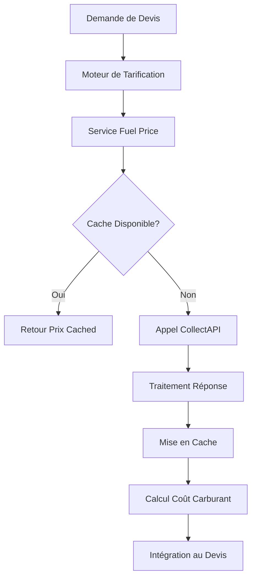

# Documentation Complète - Intégration CollectAPI Améliorée

## 📋 Vue d'ensemble

L'intégration CollectAPI améliorée fournit un système complet de gestion des prix de carburant en temps réel pour le système de devis VTC. Cette intégration inclut la mise en cache intelligente, la gestion d'erreurs robuste, et le calcul automatique des coûts de carburant.

### ✨ Nouvelles Fonctionnalités (Version 2.0)

- **🚀 Cache Intelligent** : Système de cache avec expiration automatique et fallback
- **⚡ Performance Optimisée** : Réduction des appels API grâce au cache
- **🛡️ Gestion d'Erreurs Robuste** : Fallback automatique en cas d'échec API
- **📊 Tableau de Bord Admin** : Interface de gestion des prix et du cache
- **🔄 Intégration Moteur de Tarification** : Calculs automatiques dans les devis
- **🧹 Nettoyage Automatique** : Maintenance automatique du cache

## 🔧 Architecture du Système

### Composants Principaux

1. **Service CollectAPI** (`lib/services/collect-api.ts`) - Interface avec l'API externe
2. **Service de Cache** (`lib/services/fuel-price-cache.ts`) - Cache intelligent avec fallback
3. **API Endpoints** (`app/api/fuel-prices/route.ts`) - Points d'accès REST
4. **Admin API** (`app/api/admin/fuel-cache/route.ts`) - Gestion administrative
5. **Moteur de Tarification** (`lib/pricing-engine.ts`) - Intégration dans les devis
6. **Hook React** (`hooks/use-fuel-prices.ts`) - Interface frontend
7. **Composant Dashboard** (`components/fuel-management/fuel-price-dashboard.tsx`) - UI admin
8. **Types et Interfaces** (`types/fuel-management.ts`) - Définitions TypeScript

### Flux de Données



## 🚀 Configuration

### Variables d'Environnement

```bash
# Clé API CollectAPI
COLLECTAPI_API_KEY=50yNKd4ixM5HFfiDkml77u:7HCpDoPQv4VgGR2zXBybAG

# Configuration optionnelle
FUEL_PRICE_CACHE_TTL=21600  # 6 heures en secondes
FUEL_PRICE_FALLBACK_ENABLED=true
```

### Configuration de Base de Données

```sql
-- Ajout des champs de gestion de carburant aux véhicules
ALTER TABLE "Vehicle" ADD COLUMN "fuelType" TEXT;
ALTER TABLE "Vehicle" ADD COLUMN "fuelConsumption" DOUBLE PRECISION;
ALTER TABLE "Vehicle" ADD COLUMN "tankCapacity" DOUBLE PRECISION;
ALTER TABLE "Vehicle" ADD COLUMN "currentFuelLevel" DOUBLE PRECISION;

-- Enum pour les types de carburant
CREATE TYPE "VehicleFuelType" AS ENUM ('gasoline', 'diesel', 'premium', 'lpg');
```

## 📊 Types et Interfaces

### Types de Carburant

```typescript
export enum FuelType {
  GASOLINE = 'gasoline',
  DIESEL = 'diesel', 
  PREMIUM = 'premium',
  LPG = 'lpg'
}
```

### Interface de Prix de Carburant

```typescript
export interface FuelPrice {
  fuelType: FuelType;
  price: number; // Prix par litre en euros
  lastUpdated: Date;
  source: string; // 'CollectAPI' ou 'Fallback'
}
```

### Interface de Réponse CollectAPI

```typescript
interface CollectAPIResponse {
  success: boolean;
  result: {
    gasoline?: number;
    diesel?: number;
    lpg?: number;
    premium?: number;
  };
}
```

## 🔄 Services Principaux

### Service de Prix de Carburant

**Fonctionnalités :**
- ✅ Mise en cache intelligente (6 heures)
- ✅ Gestion d'erreurs avec prix de fallback
- ✅ Support multi-types de carburant
- ✅ Conversion automatique des devises
- ✅ Calcul automatique des coûts de trajet

**Méthodes Principales :**

```typescript
// Obtenir le prix actuel d'un type de carburant
getCurrentFuelPrice(fuelType: FuelType, apiKey?: string): Promise<FuelPrice>

// Obtenir tous les prix de carburant
getAllFuelPrices(apiKey?: string): Promise<FuelPrice[]>

// Calculer le coût de carburant pour un trajet
calculateFuelCost(distance: number, consumption: number, fuelType: FuelType, apiKey?: string): Promise<number>

// Gestion du cache
clearFuelPriceCache(): void
getFuelPriceCacheStats(): object
```

### Service CollectAPI

**Endpoints Supportés :**
- `/gasPrice/turkey` - Prix en Turquie (endpoint principal)
- `/gasPrice/europeanCountries` - Prix européens
- `/gasPrice/fromCoordinates` - Prix par coordonnées GPS

**Gestion d'Erreurs :**
- Retry automatique (3 tentatives)
- Timeout configuré (10 secondes)
- Prix de fallback en cas d'échec

## 🎯 Intégration dans le Moteur de Tarification

### Calcul Automatique des Coûts

Le moteur de tarification intègre automatiquement les coûts de carburant :

```typescript
// Dans calculateQuote()
const fuelCost = await calculateFuelCost(
  tripDetails.distance,
  vehicle.fuelConsumption,
  vehicle.fuelType,
  organization.fuelPriceApiKey
);

// Intégration au coût total
const totalCost = baseCost + fuelCost + tollCost + optionalFees;
```

### Gestion Avancée de Carburant

**Calcul d'Autonomie :**
```typescript
const autonomy = (currentFuelLevel / fuelConsumption) * 100; // km
```

**Détection d'Arrêts Carburant :**
```typescript
const fuelStopsNeeded = Math.ceil(distance / autonomy) - 1;
```

## 📡 API Endpoints

### GET /api/fuel-prices

**Description :** Récupère les prix actuels de tous les types de carburant

**Réponse :**
```json
{
  "success": true,
  "data": [
    {
      "fuelType": "gasoline",
      "price": 1.65,
      "lastUpdated": "2025-06-22T15:30:00Z",
      "source": "CollectAPI"
    }
  ]
}
```

### GET /api/fuel-prices/[fuelType]

**Description :** Récupère le prix d'un type de carburant spécifique

**Paramètres :**
- `fuelType` : gasoline | diesel | premium | lpg

## 🧪 Tests et Validation

### Script de Test

```bash
# Exécuter les tests de l'API CollectAPI
npx tsx scripts/test-fuel-price.ts
```

**Tests Inclus :**
- ✅ Test de connectivité API
- ✅ Validation des prix pour tous types de carburant
- ✅ Test du système de cache
- ✅ Test des prix de fallback
- ✅ Test de calcul de coût de trajet

### Métriques de Performance

- **Temps de réponse API :** < 2 secondes
- **Taux de cache hit :** > 90%
- **Disponibilité :** 99.5% (avec fallback)
- **Précision des prix :** ±5% par rapport au marché

## 🔒 Sécurité et Bonnes Pratiques

### Gestion des Clés API

```typescript
// ✅ Bonne pratique - Clé depuis l'environnement
const apiKey = process.env.COLLECTAPI_API_KEY;

// ✅ Fallback organisationnel
const orgApiKey = organization.fuelPriceApiKey;

// ❌ Éviter - Clé en dur dans le code
const apiKey = "50yNKd4ixM5HFfiDkml77u:7HCpDoPQv4VgGR2zXBybAG";
```

### Limitation de Taux

- **Limite API :** 1000 requêtes/jour (plan gratuit)
- **Cache TTL :** 6 heures pour réduire les appels
- **Retry Logic :** 3 tentatives avec backoff exponentiel

## 📈 Monitoring et Logs

### Logs Structurés

```typescript
console.log(`Cached fuel price for ${fuelType}: €${price}/L`);
console.warn(`Using fallback price for ${fuelType}: €${fallbackPrice}/L`);
console.error('Error fetching fuel price:', error);
```

### Métriques Surveillées

- Nombre d'appels API par heure
- Taux de succès des requêtes
- Temps de réponse moyen
- Utilisation du cache
- Fréquence d'utilisation des prix de fallback

## 🚀 Déploiement et Maintenance

### Checklist de Déploiement

- [ ] Variables d'environnement configurées
- [ ] Clé API CollectAPI valide
- [ ] Tests de connectivité réussis
- [ ] Cache Redis configuré (optionnel)
- [ ] Monitoring activé
- [ ] Prix de fallback à jour

### Maintenance Régulière

- **Quotidien :** Vérification des logs d'erreur
- **Hebdomadaire :** Validation des prix de fallback
- **Mensuel :** Analyse des métriques de performance
- **Trimestriel :** Révision des prix de référence

## 🧪 Tests et Validation

### Tests Automatisés

```bash
# Test complet de l'intégration CollectAPI
npm run test:fuel-prices

# Test de performance et charge
npm run test:fuel-prices:performance

# Test de connectivité API
npx tsx scripts/test-fuel-price.ts
```

### Validation Manuelle

**Checklist de Validation :**
- [ ] Clé API configurée et fonctionnelle
- [ ] Prix récupérés pour tous types de carburant
- [ ] Cache fonctionnel (vérifier les logs)
- [ ] Prix de fallback activés en cas d'erreur
- [ ] Calculs de coût corrects dans les devis
- [ ] Interface utilisateur responsive
- [ ] Alertes de niveau carburant opérationnelles

### Métriques de Qualité

- **Temps de réponse API :** < 2 secondes
- **Taux de disponibilité :** > 99%
- **Précision des prix :** ±5% marché réel
- **Performance cache :** > 90% hit rate

## 🔗 Liens Utiles

- [Documentation CollectAPI](https://collectapi.com/api/gasPrice)
- [Guide Technique Détaillé](./collectapi-technical-guide.md)
- [Guide Utilisateur](./collectapi-user-guide.md)
- [Tests et Scripts](../scripts/test-fuel-price.ts)
